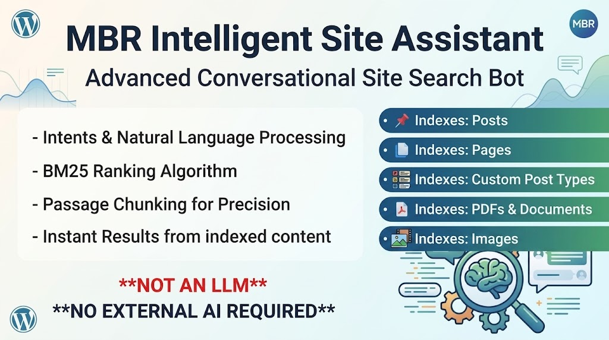

<div align="center">

# MBR Intelligent Site Assistant

**A self-hosted conversational site search for WordPress.**

No external APIs. No monthly fees. Nothing leaves your server on the visitor path.

[](https://littlewebshack.com)
[](https://wordpress.org)
[](https://www.php.net)
[](LICENSE)
[](https://littlewebshack.com)

[Download](https://littlewebshack.com) · [User guide (PDF)](#documentation) · [How it works](#how-it-works) · [Configuration](#configuration)

</div>

<!--
  Landing pages want a hero image. Drop a screenshot of the widget at
  assets/screenshot-widget.png and uncomment:

  <div align="center">
    
  </div>
-->

---

## What it is

Visitors type a question in plain English. The assistant answers with short
messages and links to the most relevant pages on your site — including the text
inside your PDFs.

All of it runs on your own server. Ranking is pure PHP and MySQL using BM25,
layered with intent matching for common questions and synonym expansion for
natural phrasing. There is no API key to obtain, no per-query cost, and no
third party sitting between your visitors and their answers.

## What it is not

Despite the word *assistant*, this is **not a large language model and it does
not generate text**. It retrieves content you have already written, and answers
a configurable list of canned questions. Ask it something you have not written
about and it will say so politely rather than inventing an answer.

That is a deliberate design choice: predictable, auditable responses with no
hallucination risk, and no outbound request carrying your visitors' questions.

---

## Features

| | |
|---|---|
| **Genuinely self-hosted** | Zero outbound requests on the visitor path. Ranking, PDF extraction and snippet generation are all local. The only network call the plugin ever makes is the optional update check. |
| **BM25 ranking** | Field-weighted (title 3.0, excerpt 1.5, body 1.0), each field length-normalised against its own average rather than the whole document. |
| **Passage chunking** | Long documents split into ~250-word overlapping chunks, each scored as its own unit, so a relevant paragraph deep inside a 30-page PDF competes on its own merits. |
| **PDF indexing** | Pure-PHP text extraction — FlateDecode, ASCII85, ASCIIHex — with no external binaries. Results deep-link to the page *and* the passage. |
| **Exact phrase search** | Quote a query to demand a literal run of words. Bypasses intents and synonyms, which is the point. |
| **Intent matching** | Pair trigger phrases with hand-written answers for questions your content does not cover. Search results are still offered beneath, where they are good enough. |
| **Synonyms and stemming** | Porter stemming plus editable synonym groups, so "WP" finds "WordPress" and "building" matches "build". |
| **Deep links** | Posts and pages link straight to the matching passage using the Text Fragments standard. No JavaScript involved. |
| **Access-control aware** | Only publicly readable content is indexed, and every result is re-tested against the live post before it is returned. Membership plugins can veto a post with one filter. |
| **Five themes** | Mocha, Slate Light, Ocean, Sunset and Forest, with an optional glassmorphism effect. All five clear WCAG AA contrast in both modes. |
| **WP-CLI** | `reindex`, `purge` and `status`, free of the web server's time and memory limits. |
| **Tunable, with an admin UI** | Intents, synonyms, appearance, content sources and privacy all have proper admin screens. No code editing required. |

---

## Quick start

```bash
# 1. Download the ZIP from littlewebshack.com
# 2. Plugins -> Add New -> Upload Plugin -> Install -> Activate
# 3. MBR Site Assistant -> Diagnostics
```

Then, in order:

1. **Choose your content sources.** Posts and pages by default; tick any custom
   post types, and enable PDF indexing if you want it.
2. **Run a full reindex.** Nothing is indexed on activation — the plugin wants
   you to check the tokeniser before it starts talking to real visitors.
3. **Test in the Chat Tester**, which runs the exact pipeline the public widget
   runs, including the raw JSON payload.
4. **Set a retention period** for the query log under Privacy.
5. **Enable the widget.** It is off by default, deliberately.

Place it inline instead of, or as well as, the floating bubble:

```
[mbr_isa_chat title="Ask us anything" greeting="What are you looking for?" height="600px"]
```

---

## How it works

Every query runs through the same pipeline:

```
query
  -> phrase check       quoted? then skip the next two stages entirely
  -> intent match       trigger phrases, substring or regex
  -> tokenise           lowercase, strip punctuation, stopwords, Porter stem
  -> synonym expansion  add equivalent terms
  -> rank               BM25 per passage chunk, title weighted above body
  -> collapse           best-scoring chunk per document
  -> format             confidence level, framing message, highlighted snippet
```

Four custom tables carry it, all prefixed with your WordPress table prefix:
`mbrisa_terms` (dictionary and document frequencies), `mbrisa_documents` (one
row per passage chunk), `mbrisa_postings` (the inverted index) and
`mbrisa_queries` (the query log).

### On visibility

Search runs through a public REST endpoint with no capability check, because a
visitor asking a question is usually not logged in. Everything indexed is
therefore reachable by anyone. The plugin treats that as the constraint it is:

- Only published, non-password-protected posts of front-end-viewable types are
  indexed.
- A PDF is indexed only when something published and publicly readable points
  at it.
- Every result is re-tested against the live post before it leaves the server,
  so a page that has since become private, protected or restricted is discarded
  rather than served.
- `mbr_isa_can_index_post` lets a membership plugin veto a post the indexer
  cannot otherwise know about. The filter is deny-only — it can tighten the
  gate, never open it.

---

## Configuration

### Filters

| Filter | Purpose |
|---|---|
| `mbr_isa_can_index_post` | Veto a post an access-control plugin knows is restricted. Deny-only. |
| `mbr_isa_pdf_scan_postmeta` | Return `false` to skip the post-meta pass when deciding whether a PDF is referenced. |
| `mbr_isa_pdf_reference_candidates` | How many candidate referencing posts are tested. Default 25, clamped to 1–500. |
| `mbr_isa_stopwords` | Filter the English stopword list before tokenisation. Requires a reindex. |
| `mbr_isa_trust_proxy` | Let the rate limiter and query log read forwarded-for headers. |

```php
// Keep a members-only post out of the index.
add_filter( 'mbr_isa_can_index_post', function ( $allowed, $post ) {
    return my_plugin_is_members_only( $post->ID ) ? false : $allowed;
}, 10, 2 );
```

### Constants

| Constant | Purpose |
|---|---|
| `MBR_ISA_TRUST_PROXY` | Set `true` behind Cloudflare or another CDN, or every visitor shares one rate-limit bucket. |
| `MBR_ISA_REQUIRE_SIGNED_UPDATES` | Refuse any update package whose checksum cannot be verified against the manifest. |

### WP-CLI

```bash
wp mbr-isa reindex              # wipe and rebuild the index
wp mbr-isa purge --dry-run      # preview rows the current rules no longer admit
wp mbr-isa purge                # remove them
wp mbr-isa status               # counts, schema version, last full reindex
```

CLI is the reliable route on a site with a large PDF library — it is not bound
by `max_execution_time` or the PHP-FPM request memory ceiling.

### REST API

Both endpoints are public and unauthenticated by design, rate-limited per
hashed IP in separate buckets.

| Endpoint | Method | Default limit |
|---|---|---|
| `/wp-json/mbr-isa/v1/ask` | POST | 30 requests/minute |
| `/wp-json/mbr-isa/v1/feedback` | POST | 20 requests/minute |

Feedback additionally requires a signed token issued alongside the answer.

---

## Privacy

- **No outbound requests on the visitor path.** Not one, from the widget, the
  REST API, or anywhere else a visitor can reach.
- **No raw IP addresses.** Where an address is needed for rate limiting, it is
  immediately hashed with SHA-256 and your site's salt.
- **No accounts, cookies or emails recorded.**
- **Query text is free-form visitor input**, so the log will eventually contain
  something personal whether or not you went looking for it. Retention is
  configurable at 7, 30 or 90 days, or indefinitely, and logging can be turned
  off entirely.

The one exception is the update checker, which performs a periodic server-side
version check and transmits no visitor data, no site content and no
identifiers. Remove the bundled checker and update manually if you would rather
have nothing outbound at all.

---

## Updates

The plugin updates itself through the normal WordPress Plugins screen. The
manifest lives on GitHub and the package on littlewebshack.com:

```
https://raw.githubusercontent.com/HarbourBob/mbr-updates/main/mbr-intelligent-site-assistant.json
```

Since 0.9.7 the manifest may carry a SHA-256 of the package, which is verified
before WordPress is allowed to unpack anything. A mismatch stops the update and
reports both digests rather than installing and hoping. This is backward
compatible — a manifest with no `checksum` key updates exactly as before.

---

## Requirements

- WordPress 5.8 or later (tested to 7.0)
- PHP 7.4 or later
- Standard MySQL or MariaDB — no special extensions for core search
- PDF indexing uses `zlib` and `mbstring`, which ship with virtually every PHP
  install
- No external services, API keys, or outbound network access to run

---

## Documentation

A comprehensive user guide is bundled as a PDF inside the ZIP — installation,
first-run setup, the diagnostic dashboard, indexing behaviour, the REST API,
privacy, troubleshooting, and a full technical reference of every setting,
filter and table.

Fittingly, the guide is also the document the plugin's own PDF indexing was
developed against.

---

## Philosophy

Free, and free of the usual strings:

- **No upsells.** There is no pro version, and no feature held back to sell you
  one later.
- **No telemetry.** The plugin does not phone home about how you use it.
- **No CDN dependencies.** Every asset is served from your own site.
- **No account required.** Download it and use it.

If it has saved you time, a coffee is very welcome — but it is a donation, not
a licence.

[](https://buymeacoffee.com/robertpalmer/)

---

## Changelog

Full history is in `readme.txt` and in chapter 2 of the user guide. Most recent:

**0.9.8** — Follow-up to the 0.9.7 code review. The PDF reference scan now
applies the same visibility decision as everything else, closing a gap where a
members-only page could still count as evidence that a PDF it links to was
published. Also fixes a long-standing cosmetic fault where a host theme's form
margin opened a stripe of background under the chat input. No schema change and
no reindex needed.

**0.9.7** — Security and scalability release prompted by an external code
review. Search-time revalidation of every result, the `mbr_isa_can_index_post`
filter, checksum-verified update packages, corpus statistics cached instead of
recalculated per query, one feedback rating per answer, and corrected
contents-page detection.

---

## Licence

GPL-2.0-or-later. See [LICENSE](LICENSE).

<div align="center">

Built by [Robert Palmer](https://madebyrobert.co.uk) · Published by
[Little Web Shack](https://littlewebshack.com)

</div>
